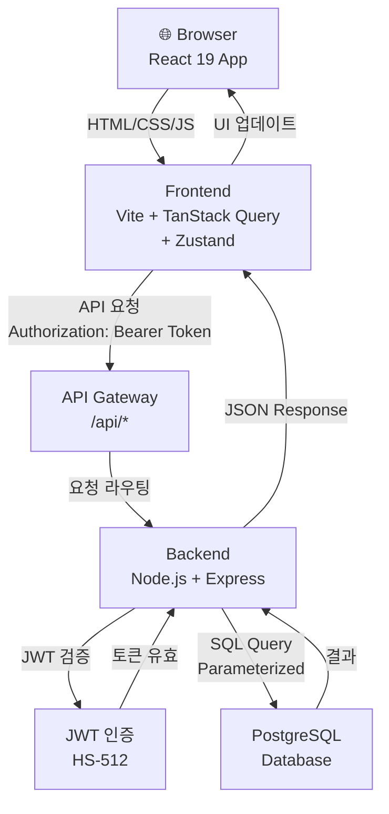
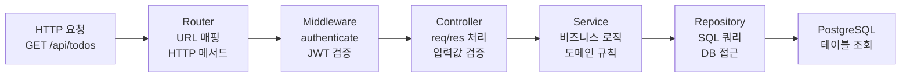
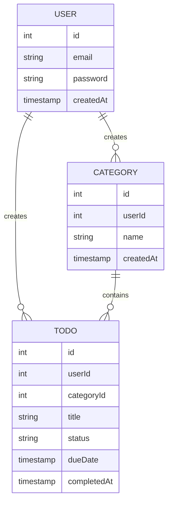
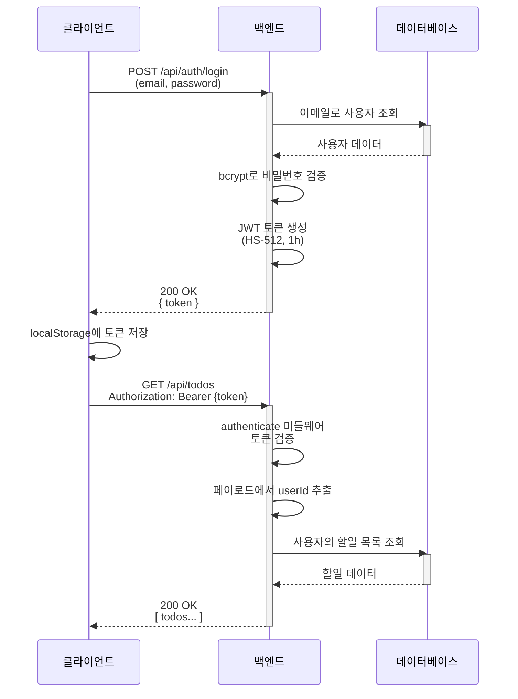

# TodoList 애플리케이션 기술 아키텍처

**버전:** 1.0
**작성일:** 2026-04-28
**작성자:** Fullstack Architect
**참조 문서:** `docs/4-project-structure.md` v1.0, `docs/1-domain-definition.md` v1.1

---

## 변경 이력

| 버전 | 변경일 | 작성자 | 변경 내용 |
|------|--------|--------|-----------|
| 1.0 | 2026-04-28 | Fullstack Architect | 최초 작성 (4개 다이어그램) |

---

## 1. 전체 시스템 구성도

3-Tier 아키텍처에서 브라우저가 프론트엔드를 거쳐 백엔드로 요청하고, JWT 인증을 통과한 후 데이터베이스에 접근하는 전체 흐름을 표현합니다.

---

## 2. 백엔드 레이어 구조

요청이 라우터에서 시작되어 미들웨어, 컨트롤러, 서비스, 레포지토리를 거쳐 데이터베이스에 도달하는 계층적 구조를 표현합니다.

---

## 3. 도메인 엔티티 관계도

사용자와 할일, 카테고리의 핵심 속성과 1:N 관계를 간단히 표현합니다.

---

## 4. 인증 시퀀스 (로그인 ~ API 호출)

로그인으로 JWT 발급 후, 이후 API 요청에서 토큰을 검증하는 인증 흐름을 시간 순서대로 표현합니다.

---

## 아키텍처 주요 특징

### Frontend
- **상태 관리**: Zustand (클라이언트 상태) + TanStack Query (서버 상태)
- **UI 프레임워크**: React 19 + Tailwind CSS (반응형)
- **API 통신**: axios 인스턴스 (요청 인터셉터에서 JWT 자동 추가)

### Backend
- **계층 분리**: Router → Middleware → Controller → Service → Repository
- **데이터 접근**: pg 라이브러리 + Parameterized Query (SQL Injection 방지)
- **에러 처리**: 중앙 에러 핸들러 + AppError 커스텀 클래스

### Database
- **DBMS**: PostgreSQL
- **인증 관계**: User 1:N Category, User 1:N Todo, Category 1:N Todo (선택)
- **보안**: 소유권 검증 (req.user.id 기준 필터링)

### 보안 정책
- **인증**: JWT HS-512 알고리즘, 1시간 만료
- **암호화**: bcrypt (salt rounds ≥ 12) 로 비밀번호 해시
- **SQL 보안**: 모든 쿼리에 파라미터 바인딩 ($1, $2, ...) 필수
- **토큰 저장**: localStorage (클라이언트에서 관리)

---

*본 문서는 프로젝트 구조 설계 원칙(docs/4-project-structure.md)을 기반으로 작성되었습니다.*
