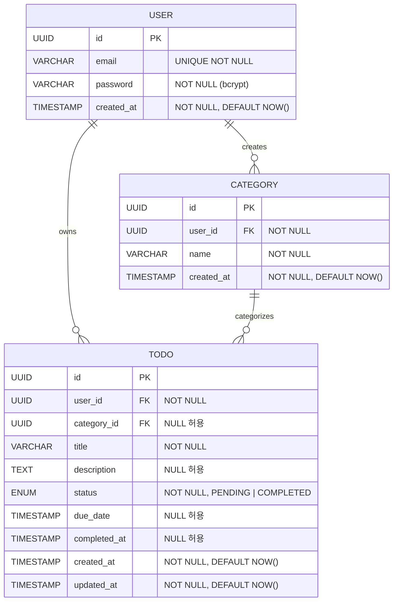
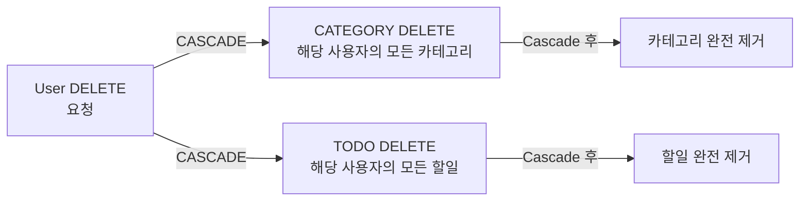

# TodoList ERD (Entity Relationship Diagram)

**버전:** 1.0  
**작성일:** 2026-04-28  
**작성자:** Technical Writer  
**참조 문서:** `docs/1-domain-definition.md` v1.1, `docs/5-arch-diagram.md` v1.0

---

## 변경 이력

| 버전 | 변경일 | 작성자 | 변경 내용 |
|------|--------|--------|-----------|
| 1.0 | 2026-04-28 | Technical Writer | 최초 작성 (완전한 Mermaid ERD, 관계 설명, 제약 조건) |

---

## 1. ERD Mermaid 코드



---

## 2. 엔티티 정의

### 2.1 USER (사용자)

| 속성 | 타입 | 제약 | 설명 |
|------|------|------|------|
| id | UUID | PK | 사용자 고유 식별자 |
| email | VARCHAR(255) | UNIQUE, NOT NULL | 로그인 이메일 (중복 불가) |
| password | VARCHAR(255) | NOT NULL | bcrypt 암호화된 비밀번호 |
| created_at | TIMESTAMP | NOT NULL, DEFAULT NOW() | 계정 생성 일시 |

**주요 특징:**
- 모든 할일과 카테고리의 소유자 역할
- Hard Delete 시 연결된 모든 데이터 함께 삭제 (CASCADE)

---

### 2.2 CATEGORY (카테고리)

| 속성 | 타입 | 제약 | 설명 |
|------|------|------|------|
| id | UUID | PK | 카테고리 고유 식별자 |
| user_id | UUID | FK → users.id, NOT NULL | 카테고리 소유자 |
| name | VARCHAR(100) | NOT NULL | 카테고리명 |
| created_at | TIMESTAMP | NOT NULL, DEFAULT NOW() | 생성 일시 |

**복합 제약:**
- UNIQUE(user_id, name): 동일 사용자 내 카테고리명 중복 불가

**주요 특징:**
- 사용자별 맞춤형 분류 단위
- 삭제 시 연결된 Todo의 categoryId는 NULL로 설정 (SET NULL)

---

### 2.3 TODO (할일)

| 속성 | 타입 | 제약 | 설명 |
|------|------|------|------|
| id | UUID | PK | 할일 고유 식별자 |
| user_id | UUID | FK → users.id, NOT NULL | 할일 소유자 |
| category_id | UUID | FK → categories.id, NULL 허용 | 분류 카테고리 (미분류 가능) |
| title | VARCHAR(255) | NOT NULL | 할일 제목 |
| description | TEXT | NULL 허용 | 상세 설명 |
| status | ENUM | NOT NULL, DEFAULT 'PENDING' | 상태 (PENDING / COMPLETED) |
| due_date | TIMESTAMP | NULL 허용 | 종료 예정 일시 |
| completed_at | TIMESTAMP | NULL 허용 | 완료 처리 일시 |
| created_at | TIMESTAMP | NOT NULL, DEFAULT NOW() | 생성 일시 |
| updated_at | TIMESTAMP | NOT NULL, DEFAULT NOW() | 최종 수정 일시 |

**주요 특징:**
- 사용자의 실제 작업 항목 (필수)
- 카테고리는 선택 사항 (NULL 허용 = 미분류)
- completedAt은 COMPLETED 상태일 때만 값 보유

---

## 3. 관계 설명

### 3.1 USER → CATEGORY (1:N)

```
USER (1) ──o< CATEGORY (N)
```

- **관계명:** creates (사용자가 카테고리를 생성)
- **카디널리티:** 1 대 0 이상
- **설명:** 하나의 사용자는 여러 카테고리를 소유할 수 있으며, 모든 카테고리는 반드시 하나의 사용자에 속한다.
- **데이터 무결성:** User 삭제 시 연결된 모든 Category 삭제 (CASCADE)

**비즈니스 규칙:** BR-CAT-01 (동일 사용자 내 카테고리명 중복 불가)

---

### 3.2 USER → TODO (1:N)

```
USER (1) ──o< TODO (N)
```

- **관계명:** owns (사용자가 할일을 소유)
- **카디널리티:** 1 대 0 이상
- **설명:** 하나의 사용자는 여러 할일을 소유할 수 있으며, 모든 할일은 반드시 하나의 사용자에 속한다.
- **데이터 무결성:** User 삭제 시 연결된 모든 Todo 삭제 (CASCADE)

**비즈니스 규칙:** BR-AUTH-03 (사용자는 자신의 데이터만 접근 가능)

---

### 3.3 CATEGORY → TODO (1:N, 선택)

```
CATEGORY (1) ──o< TODO (N)
```

- **관계명:** categorizes (카테고리가 할일을 분류)
- **카디널리티:** 1 대 0 이상
- **설명:** 하나의 카테고리는 여러 할일을 포함할 수 있으며, 할일은 카테고리 없이도 존재 가능하다 (NULL 허용).
- **데이터 무결성:** Category 삭제 시 연결된 Todo의 category_id를 NULL로 설정 (SET NULL)

**비즈니스 규칙:** BR-CAT-02 (카테고리 삭제 시 할일 자체는 유지, category_id만 null 처리)

---

## 4. 주요 제약 조건 요약

| 제약 유형 | 엔티티 | 설명 | 영향 범위 |
|-----------|--------|------|----------|
| **Primary Key** | USER, CATEGORY, TODO | 각 id는 고유 식별자 | 레코드 식별 |
| **Foreign Key** | CATEGORY.user_id | users.id 참조 | 소유권 보장 |
| **Foreign Key** | TODO.user_id | users.id 참조 | 소유권 보장 |
| **Foreign Key (선택)** | TODO.category_id | categories.id 참조 | 분류 선택 사항 |
| **UNIQUE** | USER.email | 이메일 중복 불가 | 로그인 식별자 |
| **UNIQUE (복합)** | CATEGORY(user_id, name) | 사용자별 카테고리명 중복 불가 | 카테고리 중복 방지 |
| **NOT NULL** | USER.email, password | 필수 속성 | 계정 생성 필수 |
| **NOT NULL** | CATEGORY.user_id, name | 필수 속성 | 카테고리 생성 필수 |
| **NOT NULL** | TODO.user_id, title, status | 필수 속성 | 할일 생성 필수 |
| **DEFAULT** | USER.created_at | NOW() | 자동 타임스탐프 |
| **DEFAULT** | CATEGORY.created_at | NOW() | 자동 타임스탐프 |
| **DEFAULT** | TODO.status | 'PENDING' | 기본 상태 설정 |
| **DEFAULT** | TODO.created_at, updated_at | NOW() | 자동 타임스탐프 |
| **CASCADE** | USER 삭제 | 연결된 CATEGORY, TODO 삭제 | Hard Delete |
| **SET NULL** | CATEGORY 삭제 | 연결된 TODO.category_id = NULL | 할일 유지 |

---

## 5. 데이터 무결성 및 참조 정책

### 5.1 User 삭제 시 연쇄 작동 (Hard Delete)



**규칙:** BR-AUTH-04 (탈퇴 정책)
- User 삭제 시 foreign key constraint에 의해 CATEGORY, TODO가 자동 삭제됨
- 모든 데이터는 즉시 영구 삭제 (Hard Delete)

---

### 5.2 Category 삭제 시 할일 관계 유지 (SET NULL)


**비즈니스 규칙:** BR-CAT-02 (카테고리 삭제 정책)
- Category 삭제 시 foreign key constraint에 의해 연결된 TODO의 category_id가 NULL로 설정됨
- 할일 자체는 삭제되지 않음 (미분류 상태로 전환)

---

## 6. 데이터베이스 스키마 (DDL 참고)
```sql
-- User 테이블
CREATE TABLE users (
    id UUID PRIMARY KEY DEFAULT gen_random_uuid(),
    email VARCHAR(255) UNIQUE NOT NULL,
    password VARCHAR(255) NOT NULL,
    created_at TIMESTAMP NOT NULL DEFAULT NOW()
);

-- Category 테이블
CREATE TABLE categories (
    id UUID PRIMARY KEY DEFAULT gen_random_uuid(),
    user_id UUID NOT NULL REFERENCES users(id) ON DELETE CASCADE,
    name VARCHAR(100) NOT NULL,
    created_at TIMESTAMP NOT NULL DEFAULT NOW(),
    UNIQUE(user_id, name)
);

-- Todo 테이블
CREATE TABLE todos (
    id UUID PRIMARY KEY DEFAULT gen_random_uuid(),
    user_id UUID NOT NULL REFERENCES users(id) ON DELETE CASCADE,
    category_id UUID REFERENCES categories(id) ON DELETE SET NULL,
    title VARCHAR(255) NOT NULL,
    description TEXT,
    status VARCHAR(20) NOT NULL DEFAULT 'PENDING' CHECK (status IN ('PENDING', 'COMPLETED')),
    due_date TIMESTAMP,
    completed_at TIMESTAMP,
    created_at TIMESTAMP NOT NULL DEFAULT NOW(),
    updated_at TIMESTAMP NOT NULL DEFAULT NOW()
);

-- 성능 최적화 인덱스
CREATE INDEX idx_categories_user_id ON categories(user_id);
CREATE INDEX idx_todos_user_id ON todos(user_id);
CREATE INDEX idx_todos_category_id ON todos(category_id);
CREATE INDEX idx_todos_status ON todos(status);
CREATE INDEX idx_todos_due_date ON todos(due_date);
```

---

## 7. 관계 매핑 요약

| 관계 | 주 엔티티 | 종속 엔티티 | 카디널리티 | FK | 삭제 정책 | 비고 |
|------|----------|-----------|-----------|----|---------|----|
| creates | USER | CATEGORY | 1:N | user_id | CASCADE | 사용자는 여러 카테고리 보유 |
| owns | USER | TODO | 1:N | user_id | CASCADE | 사용자는 여러 할일 보유 |
| categorizes | CATEGORY | TODO | 1:N | category_id | SET NULL | 할일의 카테고리 선택 사항 |

---

## 8. 관계 정규화 분석

### 정규화 상태: 제3정규형 (3NF)

- **제1정규형 (1NF):** 모든 속성이 원자값 (O)
- **제2정규형 (2NF):** 부분 함수 종속 제거 (O)
- **제3정규형 (3NF):** 이행 함수 종속 제거 (O)

### 특수 고려 사항

**CATEGORY의 복합 UNIQUE 제약:**
- (user_id + name)의 조합으로 유일성 보장
- 동일 사용자 내에서만 카테고리명 중복 방지
- 다른 사용자는 동일 이름 사용 가능

**TODO의 NULL 허용:**
- category_id는 NULL 허용 (미분류 상태)
- due_date, description, completed_at도 NULL 허용 (선택 입력)
- 이는 정규화를 위반하지 않음 (선택적 관계)

---

## 9. 확장성 및 향후 고려사항

### 성능 최적화
- user_id, category_id, status 등 자주 필터링되는 속성에 인덱스 설계 필요
- due_date 인덱스는 기한 표시 및 정렬 성능 향상

### 향후 기능 확장 가능성
1. **Priority (우선순위):** TODO에 priority 속성 추가
2. **Tags (태그):** Todo-Tag 중간 테이블 추가 (M:N 관계)
3. **Sharing (공유):** User-Todo-Share 중간 테이블 추가 (M:N 관계)
4. **Subtasks (부작업):** Todo-Subtask 계층 관계 추가
5. **Recurring (반복):** 반복 할일 규칙 저장 테이블 추가

---

*본 문서는 `docs/1-domain-definition.md`의 도메인 모델을 바탕으로 데이터베이스 설계 관점에서 작성되었습니다.*
